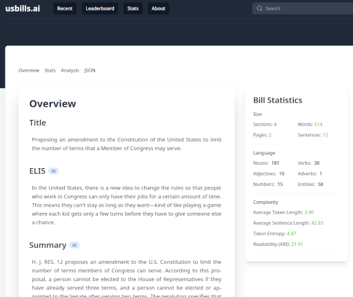

# usbills.ai

Making US federal legislation accessible through natural language processing and AI.

[]

## Overview

usbills.ai is an open source project designed to make federal legislation easier to understand for the general public. We use artificial intelligence to provide clear explanations and highlight key points from US Federal bills.

Key features include:

- Collection of bill data from govinfo.gov API
- Text analysis using traditional NLP (spacy) and LLMs (e.g., models from OpenAI, Anthropic) 
- Plain language summaries and ELI5 explanations
- Key issue identification
- Readability metrics and statistics
- Financial analysis
- A free, open API to retrieve the annotated bills and sections

## API
The API documentation is available at [https://usbills.ai/docs](https://usbills.ai/docs).

The OpenAPI spec is available at [https://usbills.ai/openapi.json](https://usbills.ai/openapi.json).

## Key Components

### Data Collection

Bills are retrieved directly from the govinfo.gov API and updated daily. For each bill we:

- Download official metadata and XML version
- Parse and extract content, structure and key information
- Store in standardized format for analysis

### Analysis 

The analysis process includes:

#### Traditional NLP
- Tokenization
- Syntactic parsing and POS tagging 
- Named entity recognition

#### LLM Analysis
- Plain language summaries
- Key issue identification
- ELI5 descriptions
- Commentary on implications
- Named entity filtering

### Metrics

The project calculates various metrics including:

#### Basic Stats
- Section count
- Word/token count 
- Character count
- Sentence count

#### Language Statistics
- Parts of speech distribution
- Key phrases
- Entity counts

#### Complexity Metrics
- Average word length
- Average sentence length
- Token entropy
- Automated Readability Index (ARI)

## Important Notes

- AI-generated content is marked with an AI tag
- Analysis is meant to supplement, not replace human review 
- Always refer to official sources and consult legal professionals

## Contributing

We welcome contributions! Please feel free to submit a Pull Request.

## Support

If you encounter any issues or have questions, please [open an issue](https://github.com/alea-institute/usbills.ai/issues).

## License

Project source code and data are licensed under Creative Commons Attribution 4.0 International License.

## Learn More 

Visit [usbills.ai](https://usbills.ai) to explore the project.

An [ALEA Institute](https://aleainstitute.ai) project.